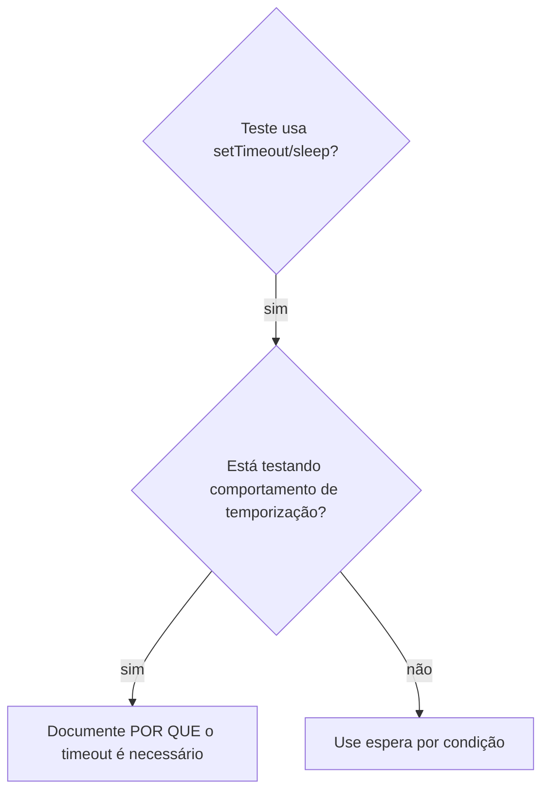

# Espera por condição

## Visão geral

Teste instável costuma chutar temporização com atraso arbitrário. Isso cria condição de corrida: passa na máquina rápida do dev e falha sob carga ou na esteira.

**Princípio central:** espere pela condição que você realmente quer, não por um palpite de quanto tempo ela leva.

## Quando usar



**Use quando:**

- os testes têm atrasos arbitrários (`setTimeout`, `sleep`, `Thread.sleep`)
- os testes são instáveis (passam às vezes, falham sob carga)
- os testes estouram timeout quando rodam em paralelo
- você está esperando operação assíncrona terminar

**Não use quando:**

- está testando o próprio comportamento temporal (debounce, throttle, intervalo de polling)
- e, mesmo aí, sempre documente POR QUE o timeout arbitrário é necessário

## Padrão central

```typescript
// ❌ ANTES: chutando a temporização
await new Promise(r => setTimeout(r, 50));
const resultado = obterResultado();
expect(resultado).toBeDefined();

// ✅ DEPOIS: esperando a condição
await esperarPor(() => obterResultado() !== undefined, 'resultado disponível');
const resultado = obterResultado();
expect(resultado).toBeDefined();
```

## Padrões rápidos

| Cenário | Padrão |
|---|---|
| Esperar evento | `esperarPor(() => eventos.find(e => e.tipo === 'DONE'), 'evento DONE')` |
| Esperar estado | `esperarPor(() => maquina.estado === 'pronto', 'máquina pronta')` |
| Esperar contagem | `esperarPor(() => itens.length >= 5, '5 itens')` |
| Esperar elemento montar | `esperarPor(() => document.querySelector('app-remote')?.shadowRoot, 'remote montado')` |
| Esperar arquivo existir | `esperarPor(() => fs.existsSync(caminho), caminho)` |
| Condição composta | `esperarPor(() => obj.pronto && obj.valor > 10, 'objeto pronto com valor')` |

## Implementação

Função genérica de polling:

```typescript
export async function esperarPor<T>(
  condicao: () => T | undefined | null | false,
  descricao: string,
  timeoutMs = 5000,
): Promise<T> {
  const inicio = Date.now();

  while (true) {
    const resultado = condicao();
    if (resultado) return resultado;

    if (Date.now() - inicio > timeoutMs) {
      throw new Error(`Timeout esperando por ${descricao} após ${timeoutMs}ms`);
    }

    await new Promise(r => setTimeout(r, 10)); // polling a cada 10ms
  }
}
```

Helpers de domínio, construídos sobre a mesma primitiva:

```typescript
export const esperarEvento = (bus: Bus, tipo: string, timeoutMs?: number) =>
  esperarPor(() => bus.eventos.find(e => e.tipo === tipo), `evento ${tipo}`, timeoutMs);

export const esperarContagemDeEventos = (bus: Bus, tipo: string, n: number, timeoutMs?: number) =>
  esperarPor(
    () => bus.eventos.filter(e => e.tipo === tipo).length >= n || undefined,
    `${n}x evento ${tipo}`,
    timeoutMs,
  );

export const esperarEventoQueCase = <E>(bus: Bus, casa: (e: E) => boolean, desc: string) =>
  esperarPor(() => bus.eventos.find(casa), desc);
```

## Erros comuns

- **❌ Polling rápido demais:** `setTimeout(check, 1)` — desperdiça CPU. **✅** 10ms.
- **❌ Sem timeout:** laço infinito se a condição nunca ocorrer. **✅** sempre com timeout e mensagem clara.
- **❌ Dado velho:** capturar o estado antes do laço. **✅** chame o getter dentro do laço, para ler valor fresco.

## Quando o timeout arbitrário ESTÁ correto

```typescript
// A ferramenta emite tick a cada 100ms — precisamos de 2 ticks para verificar saída parcial
await esperarEvento(bus, 'TOOL_STARTED');      // 1º: espere a condição de disparo
await new Promise(r => setTimeout(r, 200));     // 2º: espere o comportamento temporal
// 200ms = 2 ticks de 100ms — documentado e justificado
```

**Requisitos:**

1. primeiro espere a condição que dispara
2. o valor vem de temporização conhecida, não de chute
3. comentário explicando POR QUÊ
