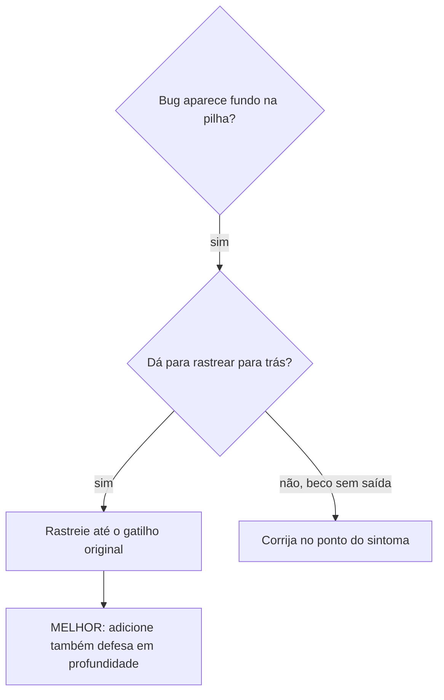
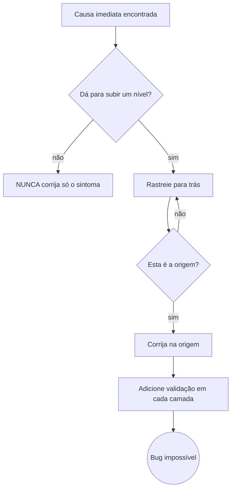

# Rastreio de causa raiz

## Visão geral

Bugs frequentemente se manifestam fundo na pilha de chamadas (requisição sai para a origem errada, arquivo criado no diretório errado, conexão aberta com o path errado). O instinto é corrigir onde o erro aparece — isso é tratar sintoma.

**Princípio central:** rastreie para trás pela cadeia de chamadas até achar o gatilho original, e corrija na origem.

## Quando usar



**Use quando:**

- o erro acontece fundo na execução, não no ponto de entrada
- o stack trace mostra uma cadeia longa de chamadas
- não está claro onde o dado inválido se originou
- você precisa achar qual teste ou qual código dispara o problema

## O processo de rastreio

### 1. Observe o sintoma

```
GET https://shell.exemplo.com/v1/clientes → 404, corpo em text/html
```

### 2. Ache a causa imediata

**Que código causa isso diretamente?**

```typescript
return this.http.get<Cliente[]>(`${this.config.baseUrl}/v1/clientes`);
```

### 3. Pergunte: quem chamou isto?

```typescript
ClienteService.listar()
  → chamado por ClientesFacade.carregar()
  → chamado por ClientesPageComponent.ngOnInit()
  → montado pelo shell via <app-clientes-remote>
```

### 4. Continue subindo

**Que valor foi passado?**

- `config.baseUrl = ''` (string vazia!)
- URL relativa resolve contra a origem do documento
- a origem do documento é o shell, não o BFF → 404 servindo o `index.html` do shell

### 5. Ache o gatilho original

**De onde veio a string vazia?**

```typescript
// no custom element do remote
connectedCallback() {
  this.apiConfig.baseUrl = this.getAttribute('api-base-url') ?? ''; // lido cedo demais
}
```

O shell define a propriedade *depois* de inserir o elemento no DOM. `connectedCallback` já rodou. O atributo ainda não existia.

**Causa raiz:** contrato do custom element — leitura de entrada no momento errado do ciclo de vida, com fallback silencioso para `''`.

**Correção na origem:** ler a entrada por setter/`attributeChangedCallback` e falhar alto quando ausente, em vez de cair para string vazia.

**Defesa em profundidade adicionada:**

- Camada 1: o setter rejeita valor vazio ou não absoluto
- Camada 2: o service recusa montar URL com `baseUrl` falsy
- Camada 3: interceptor recusa request cuja origem seja a do documento em ambiente não-local
- Camada 4: log com stack trace antes da primeira chamada HTTP

## Adicionando stack traces

Quando não dá para rastrear manualmente, instrumente:

```typescript
function montarUrl(baseUrl: string, path: string) {
  const stack = new Error().stack;
  console.error('DEBUG montarUrl:', {
    baseUrl,
    path,
    origem: location.origin,
    stack,
  });
  return `${baseUrl}${path}`;
}
```

**Crítico:** em teste, use `console.error()` e não o logger da aplicação — o logger pode estar suprimido.

**Rode e capture:**

```bash
npm test 2>&1 | grep 'DEBUG montarUrl'
```

**Analise os stack traces:**

- procure nomes de arquivo de teste
- ache a linha que dispara a chamada
- identifique o padrão: é sempre o mesmo teste? o mesmo parâmetro?

O mesmo vale fora do browser. Em Java, o equivalente do `new Error().stack` é logar `Thread.currentThread().getStackTrace()` — ou um `IllegalStateException` construído e não lançado — imediatamente antes da operação perigosa.

## Achando qual teste polui o ambiente

Se algo aparece durante a suíte mas você não sabe qual teste causou, bissecte: rode um teste por vez e pare no primeiro que reproduz o efeito.

```bash
#!/usr/bin/env bash
# find-polluter.sh <artefato-que-nao-deveria-existir> <glob-de-testes>
ARTEFATO="$1"; GLOB="$2"
for t in $GLOB; do
  rm -rf "$ARTEFATO"
  npm test -- "$t" >/dev/null 2>&1
  if [ -e "$ARTEFATO" ]; then echo "POLUIDOR: $t"; exit 1; fi
done
echo "nenhum poluidor isolado — o efeito depende de ordem/paralelismo"
```

Se o script não isolar ninguém, a poluição depende de ordem ou de execução paralela: repita com a suíte serializada e com a ordem fixada por seed.

## Exemplo real resumido

**Sintoma:** 404 em HTML numa chamada que funciona no `ng serve` isolado.

**Cadeia de rastreio:**

1. request sai para a origem do shell ← `baseUrl` vazio
2. service recebeu config com `baseUrl` vazio
3. config foi preenchida no `connectedCallback`
4. `connectedCallback` rodou antes de o shell setar a propriedade
5. o fallback `?? ''` transformou "ausente" em "válido"

**Correção:** entrada por setter com validação; ausência vira erro, não string vazia.

## Princípio



**NUNCA corrija apenas onde o erro aparece.** Rastreie até o gatilho original.

## Dicas de stack trace

- **Em teste:** `console.error()`, não logger — logger pode estar suprimido
- **Antes da operação:** logue antes da operação perigosa, não depois da falha
- **Inclua contexto:** diretório, origem, variáveis de ambiente, timestamp, correlation-id
- **Capture a pilha:** `new Error().stack` mostra a cadeia completa de chamadas
