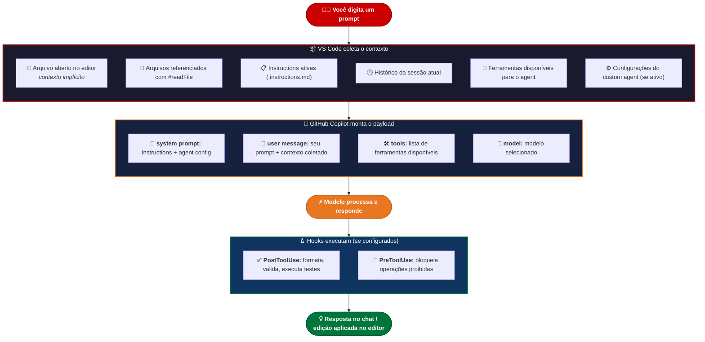

# 02 — Harness Engineering

---

> ⚠️ **AVISO DE GOVERNANÇA**
> Nenhum arquivo de configuração do GitHub Copilot (instructions, agents, skills, hooks, prompts) deve ser commitado no repositório. O push desses arquivos deve ser bloqueado. Toda configuração vive **localmente na máquina do desenvolvedor** e a documentação oficial fica neste Confluence. Consulte o time de arquitetura em caso de dúvidas sobre o que pode ou não entrar no repositório.
> **Justificativa:** Estes arquivos de configuração modificam o comportamento do GitHub Copilot no nível da IDE e são específicos do ambiente.
> **Implementação:** Copie os arquivos para a estrutura de diretório **.github/** do seu projeto e adicione as exclusões apropriadas no **.gitignore**.

---

## 📋 O que você vai encontrar neste documento

- O que é Harness Engineering e de onde veio o conceito
- Como o VS Code, o GitHub Copilot e o modelo se comunicam
- O que compõe o harness no nosso ambiente
- Como cada peça do harness afeta qualidade e custo
- Estratégias práticas para extrair mais do harness no dia a dia
- O que otimizar primeiro quando o resultado não está bom

---

## 🎯 1. O que é Harness Engineering

O termo "harness" vem da engenharia de testes — um test harness é o conjunto de ferramentas, fixtures e configurações que criam o ambiente controlado onde um teste executa. O conceito foi expandido para o contexto de IA: um **AI harness** é o conjunto de configurações, contextos, instruções e ferramentas que criam o ambiente controlado onde o modelo opera.

Em linguagem direta: o harness é **tudo que você configura ao redor do modelo** para que ele se comporte como você quer, sem precisar repetir isso em cada prompt.

Um desenvolvedor que abre o chat e digita "crie um componente Angular" está usando o harness padrão — o modelo faz o melhor que pode com zero contexto. Um desenvolvedor que configurou instructions com os padrões do projeto, um agent para o modo de implementação, skills para as tarefas recorrentes e hooks para validação automática está usando um harness otimizado — o modelo opera com contexto rico e restrições claras.

> A diferença de qualidade entre os dois cenários não é o modelo. É o harness.

---

## 🔄 2. Como o ecossistema se comunica

Quando você envia uma mensagem no chat do VS Code, o seguinte acontece:



> 💡 **Cada elemento desse fluxo é uma alavanca do harness.** Quanto mais bem configuradas as alavancas, menos o modelo precisa "adivinhar" — e menos tokens são desperdiçados em correções.

---

## 🧩 3. As peças do harness no nosso ambiente

| **Peça**                 | **O que faz**                                                           | **Onde vive**                                          | **Doc relacionado**                                     |
| ------------------------ | ----------------------------------------------------------------------- | ------------------------------------------------------ | ------------------------------------------------------- |
| **Custom Instructions**  | Define padrões de código, stack, convenções — aplicado em toda sessão   | Local (`~/.copilot/instructions/` ou pasta do projeto) | [07 — Custom Instructions](./07-custom-instructions.md) |
| **Custom Agents**        | Define personas especializadas com ferramentas e instruções específicas | Local (`.github/agents/`)                              | [05 — Custom Agents](./05-custom-agents.md)             |
| **Agent Skills**         | Capacidades reutilizáveis carregadas sob demanda                        | Local (`.github/skills/`)                              | [06 — Custom Skills](./06-custom-skills.md)             |
| **Hooks**                | Scripts executados em eventos do ciclo de vida do agente                | Local (`.github/hooks/`)                               | [08 — Hooks](./08-hooks.md)                             |
| **Prompt Files**         | Prompts reutilizáveis invocados como slash commands                     | Local (`.github/prompts/`)                             | [09 — Prompt Files](./09-prompt-files.md)               |
| **Contexto de arquivos** | `#readFile`, `#fileSearch` — contexto cirúrgico                         | Referenciado no prompt                                 | [01 — Tokens e Custos](./01-tokens-e-custos.md)         |
| **Escolha de modelo**    | Calibra capacidade vs. custo por tarefa                                 | Seletor no chat                                        | [01 — Tokens e Custos](./01-tokens-e-custos.md)         |

---

## 📊 4. Como o harness afeta qualidade e custo

### Sem harness configurado

```
Dev: "Crie um componente de listagem de renegociações"

Modelo recebe:
  system: [instruções padrão genéricas do Copilot]
  user: "Crie um componente de listagem de renegociações"
  contexto: nenhum

Resultado provável:
  → Componente com NgModule (projeto usa standalone)
  → @Input()/@Output() decorators (projeto usa signals)
  → Estado local no componente (projeto usa NgRx Signals Store)
  → Nenhuma cobertura de teste

Rounds necessários para corrigir: 3–5
Custo total estimado: 8.000–15.000 tokens
```

### Com harness bem configurado

```
Dev: "Crie um componente de listagem de renegociações"

Modelo recebe:
  system: [instructions com stack Angular 21, padrões do projeto,
           convenções de nomenclatura, regras de segurança]
  user: "Crie um componente de listagem de renegociações"
  contexto: spec.md da feature + componente similar via #readFile
  agent: implementação (Agent mode com ferramentas corretas)

Resultado provável:
  → Standalone component correto
  → Signals e inject() function
  → Integração com NgRx Signals Store
  → Estrutura de teste Jest já incluída

Rounds necessários para corrigir: 0–1
Custo total estimado: 2.000–4.000 tokens
```

A diferença não é mágica — é contexto. O harness entrega o contexto certo no momento certo.

---

## ⚙️ 5. Como otimizar o harness no dia a dia

### 5.1 Priorize as instructions como base

As instructions são a fundação do harness. Elas são aplicadas em toda sessão automaticamente. Um bom arquivo de instructions para o `recr-fed-agc-posvenda` elimina a necessidade de repetir stack, padrões e regras em cada prompt.

O que colocar nas instructions (veja o doc completo em [07 — Custom Instructions](./07-custom-instructions.md)):

- Stack técnica completa
- Convenções de nomenclatura
- Padrões obrigatórios (standalone, inject(), signals)
- Regras de segurança (sem hardcode de tokens, HTTP só via service)
- Padrões de teste Jest

### 5.2 Use agents para separar personas

Crie agents distintos para fases distintas do trabalho. Um agent de planejamento com acesso apenas a ferramentas de leitura evita que o modelo edite arquivos quando você só quer pensar. Um agent de implementação com acesso a edição e terminal é o ambiente certo para executar tasks.

Exemplo prático para o recr-fed-agc-posvenda:

```
Agent: sdd-planner
  → Ferramentas: search, readFile, web (somente leitura)
  → Instrução: criar artefatos SDD sem implementar código
  → Uso: Fase 0, 1 e 2 do SDD

Agent: feature-implementer
  → Ferramentas: editFile, createFile, terminal
  → Instrução: implementar tasks do tasks.md, uma por vez
  → Uso: Fase 3 do SDD

Agent: code-reviewer
  → Ferramentas: readFile, search
  → Instrução: revisar código contra spec, sem editar
  → Uso: Fase 4 do SDD
```

### 5.3 Use skills para capacidades recorrentes

Skills são ideais para tarefas que você repete em todo projeto: criar um componente standalone, criar um store NgRx Signals, criar um service com tratamento de erro. Em vez de descrever o padrão em cada prompt, a skill carrega o contexto automaticamente quando relevante.

### 5.4 Use hooks para automação pós-edição

Hooks executam scripts no ciclo de vida do agente. Um hook `PostToolUse` que roda o lint e os testes Jest após cada edição de arquivo fecha o loop de qualidade sem esforço manual — o agente escreve, o hook valida, você revisa o resultado.

### 5.5 Use prompt files para tarefas padronizadas

Prompt files evitam que cada dev escreva o mesmo prompt de formas diferentes. Um `/criar-store` que já tem o padrão NgRx Signals embutido garante consistência entre o time sem depender de memória individual.

---

## 🔍 6. Diagnóstico: o que otimizar quando o resultado não está bom

Use este guia quando o Copilot gerar código que não segue os padrões do projeto:

```
SINTOMA: Código não segue a stack (usando NgModule, @Input, estado local)
CAUSA PROVÁVEL: Instructions não configuradas ou não carregadas
SOLUÇÃO: Verifique se o arquivo .instructions.md existe e está no caminho correto
         Confirme que o setting chat.instructionsFilesLocations aponta para ele

SINTOMA: Código correto no padrão mas ignora regras de negócio específicas
CAUSA PROVÁVEL: Contexto insuficiente — spec ou arquivo de referência não carregado
SOLUÇÃO: Adicione #readFile com o spec.md e um arquivo similar como referência

SINTOMA: Agent editando arquivos que não deveria tocar
CAUSA PROVÁVEL: Agent com acesso amplo demais ou uso de @workspace
SOLUÇÃO: Crie um custom agent com ferramentas restritas para a tarefa
         Nunca use @workspace — use #readFile com caminhos específicos

SINTOMA: Muitos rounds de correção para chegar no resultado esperado
CAUSA PROVÁVEL: Prompt vago, spec incompleta ou modelo subdimensionado
SOLUÇÃO: Revise o prompt (adicione contexto, seja mais específico)
         Verifique se a spec.md tem os detalhes suficientes
         Considere subir um nível no modelo (Haiku → Sonnet)

SINTOMA: Consumo de créditos muito alto por feature
CAUSA PROVÁVEL: Modelo premium em tarefas simples, @workspace, sessões fragmentadas
SOLUÇÃO: Revise a matriz de modelos (doc 01)
         Use #readFile em vez de @workspace
         Mantenha uma sessão por feature (aproveite o cache)

SINTOMA: Hook não executando após edição de arquivo
CAUSA PROVÁVEL: Arquivo de hook no caminho errado ou JSON inválido
SOLUÇÃO: Verifique o output channel "GitHub Copilot Chat Hooks" no VS Code
         Confirme que o arquivo está em .github/hooks/*.json
         Valide o JSON do hook (use um validador online)
```

---

## 🚀 7. Visão do harness ideal para o recr-fed-agc

Este é o estado alvo — um harness completamente configurado para o projeto:

```
recr-fed-agc/
│
├── .github/
│   ├── agents/
│   │   ├── sdd-planner.agent.md        ← agent de planejamento (somente leitura)
│   │   ├── feature-implementer.agent.md ← agent de implementação
│   │   └── code-reviewer.agent.md      ← agent de revisão
│   │
│   ├── skills/
│   │   ├── angular-standalone/         ← skill para criar componentes
│   │   │   └── SKILL.md
│   │   ├── ngrx-signals-store/         ← skill para criar stores
│   │   │   └── SKILL.md
│   │   └── jest-unit-test/             ← skill para criar testes
│   │       └── SKILL.md
│   │
│   ├── hooks/
│   │   └── quality-gate.json           ← hook: lint + test após edição
│   │
│   ├── prompts/
│   │   ├── criar-store.prompt.md       ← /criar-store
│   │   ├── criar-componente.prompt.md  ← /criar-componente
│   │   └── revisar-pr.prompt.md        ← /revisar-pr
│   │
│   └── instructions/
│       ├── stack.instructions.md       ← stack e convenções gerais
│       ├── angular.instructions.md     ← padrões Angular 21
│       └── seguranca.instructions.md   ← regras de segurança do banco

ATENÇÃO: Nada acima entra no repositório.
Toda a pasta .github/agents, .github/skills, .github/hooks,
.github/prompts e .github/instructions deve estar no .gitignore
ou é bloqueada no push pelo pipeline do banco.
```

---

## 🔗 Referências

- [Agent Harnesses, GitHub Copilot and VS Code — VS Code Blog](https://code.visualstudio.com/blogs/2026/05/15/agent-harnesses-github-copilot-vscode)
- [AI Harness: Testing and Evaluating AI Systems — Databricks](https://www.databricks.com/br/blog/ai-harness)
- [O que é Engenharia de Harness? — Alura](https://www.alura.com.br/empresas/artigos/engenharia-de-harness)
- [Agent Customization Overview — VS Code Docs](https://code.visualstudio.com/docs/agent-customization/overview)

---

_Documento: 02 — Harness Engineering | Junho 2026_
_Anterior: [01 — Tokens e Custos](./01-tokens-e-custos.md) | Próximo: [03 — Spec-Driven Development (SDD)](./03-sdd.md)_
