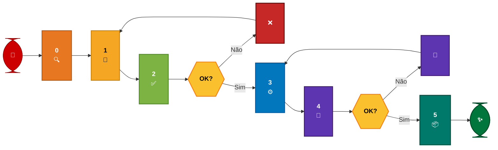
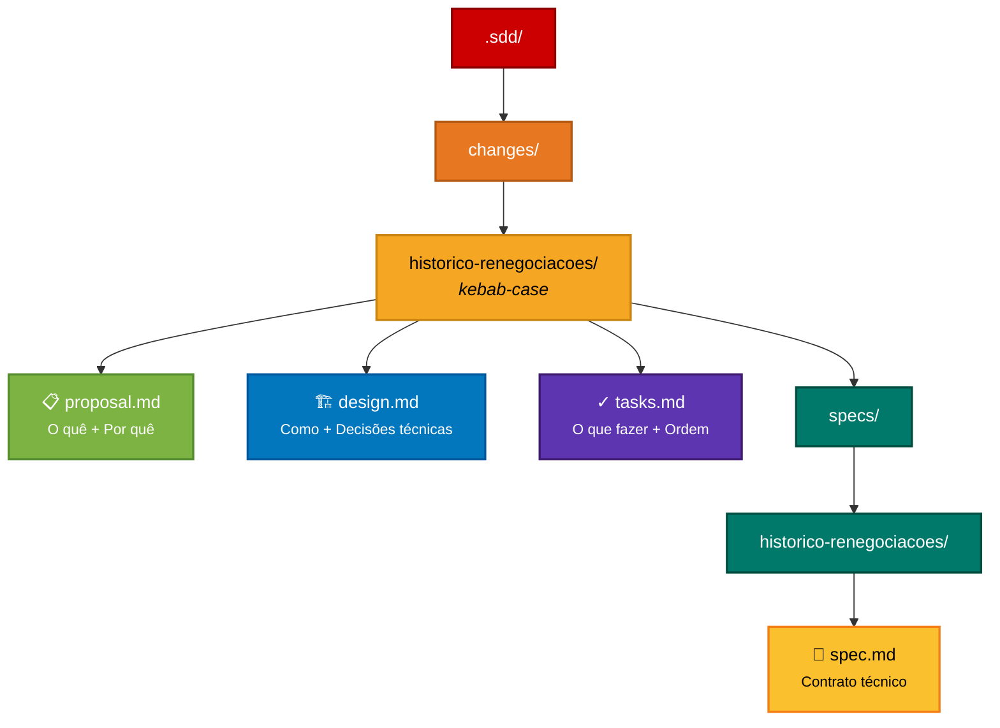

# 03 — Spec-Driven Development (SDD)

---

> ⚠️ **AVISO DE GOVERNANÇA**
> Nenhum arquivo de configuração do GitHub Copilot deve ser commitado no repositório. O push desses arquivos é bloqueado automaticamente pelo pipeline do banco. Os arquivos SDD (proposal.md, design.md, tasks.md, specs/) vivem **dentro do repositório como documentação técnica da feature** — isso é permitido e recomendado. O que não pode entrar no repo são os arquivos de configuração do Copilot (.instructions.md, .agent.md, hooks, prompts).
> **Justificativa:** Estes arquivos de configuração modificam o comportamento do GitHub Copilot no nível da IDE e são específicos do ambiente.
> **Implementação:** Copie os arquivos para a estrutura de diretório **.github/** do seu projeto e adicione as exclusões apropriadas no **.gitignore**.

---

## 📋 O que você vai encontrar neste documento

| **Tópico**                | **Descrição**                                     |
| ------------------------- | ------------------------------------------------- |
| **O que é SDD**           | Conceito, benefícios e paralelo com TDD/BDD/DDD   |
| **Fluxo em 5 fases**      | Do zero ao código em produção com diagrama visual |
| **Estrutura de arquivos** | Hierarquia SDD e artefatos necessários            |
| **Templates prontos**     | proposal.md, design.md, tasks.md, spec.md         |
| **Como executar**         | Passo-a-passo para cada fase no VS Code           |
| **Matriz de modelos**     | Qual modelo + modo usar em cada situação          |
| **SDD com OpenSpec**      | Framework de automação e quando usar              |

---

## 🎯 1. O que é SDD e por que adotar

### 📌 Definição

> **Spec-Driven Development** é uma metodologia onde **a especificação precede e guia a implementação**. Antes de escrever uma linha de código, você cria um conjunto de artefatos que descrevem o que será construído, quais decisões técnicas foram tomadas e quais tarefas precisam ser executadas — nessa ordem.

### 🏦 Por que no Bradesco

No contexto do banco, isso não é burocracia: é **proteção**. Código que vai para produção financeira precisa ser rastreável, revisado e previsível. A spec é o contrato entre o que foi pedido e o que foi entregue.

> 🔐 **Regra de ouro:** Uma spec errada gera código errado. Corrigir código errado custa **5× mais tokens** do que corrigir a spec.

### 🤖 Por que funciona com IA

A IA não tem contexto do negócio. Ela executa o que você descreve:

- ❌ Descrição vaga → código vago
- ✅ Descrição precisa → código preciso

O SDD força a precisão **antes** da execução — e isso reduz drasticamente o número de rounds de correção, que são os maiores consumidores de tokens.

### Paralelo com outras metodologias

| **Metodologia** | **Foco principal**       | **O que guia o desenvolvimento**           |
| --------------- | ------------------------ | ------------------------------------------ |
| **TDD**         | Comportamento esperado   | Testes escritos antes do código            |
| **BDD**         | Comportamento do usuário | Cenários em linguagem natural (Gherkin)    |
| **DDD**         | Domínio do negócio       | Linguagem ubíqua e bounded contexts        |
| **SDD**         | Especificação técnica    | Artefatos de design antes da implementação |

SDD não substitui nenhum dos outros — ele **orquestra**. Você pode escrever os testes do TDD dentro das tasks do SDD. Pode usar a linguagem do DDD na spec. Pode descrever cenários BDD no proposal. O SDD é o envelope que organiza tudo antes de abrir o agente.

---

## 🔄 2. O fluxo completo em 5 fases



| **Fase** | **O que fazer**                                        |
| -------- | ------------------------------------------------------ |
| **0** 🔍 | Entender o problema antes de escrever                  |
| **1** 📝 | Criar os artefatos SDD (proposal, design, tasks, spec) |
| **2** ✅ | **Validar artefatos (Gate crítico)**                   |
| **3** ⚙️ | Implementar task por task com o agente                 |
| **4** 🧪 | Testar e validar contra a spec                         |
| **5** 📦 | Mover SDD para Confluence e arquivar                   |

> ⚠️ **A regra inegociável:** nunca pule a **Fase 2**. A revisão dos artefatos antes de qualquer linha de código protege o banco de código gerado com base em spec incorreta.

---

## 📁 3. Estrutura de arquivos SDD

Todo ciclo SDD cria a seguinte estrutura dentro do repositório, na pasta `.sdd/changes/`:



### Artefatos SDD

| **Arquivo**     | **Ícone** | **Descrição**       | **Contém**                                                                       |
| --------------- | --------- | ------------------- | -------------------------------------------------------------------------------- |
| **proposal.md** | 📋        | O QUÊ + POR QUÊ     | Contexto, motivação, escopo, critérios de aceite, dependências, riscos           |
| **design.md**   | 🏗️        | COMO + DECISÕES     | Arquitetura, componentes, contratos de API, padrões, alternativas                |
| **tasks.md**    | ✓         | O QUE FAZER + ORDEM | Lista de tarefas atômicas, dependências, arquivos de destino                     |
| **spec.md**     | 📄        | CONTRATO TÉCNICO    | Interfaces TypeScript, comportamento por cenário, validações, tratamento de erro |

---

## 📝 4. Templates prontos

### 📋 proposal.md

> Descreve a mudança em linguagem próxima do negócio — **o que** será feito e **por que**.

```markdown
# Proposal: [Nome da Feature]

## Contexto

[Por que essa mudança é necessária? Qual problema resolve?]

## O que será construído

[Descrição objetiva do escopo]

## Non-Goals (o que fica fora)

- [O que explicitamente NÃO será feito]

## Critérios de Aceite

- [ ] Critério verificável 1
- [ ] Critério verificável 2

## Dependências

- [Componentes/APIs/Stores afetados]

## Riscos

- [Riscos técnicos ou de negócio]
```

### 🏗️ design.md

> Descreve as decisões técnicas — **como** a solução será implementada.

```markdown
# Design: [Nome da Feature]

## Decisão de Arquitetura

[Abordagem escolhida + justificativa]

## Componentes Envolvidos

- **Store:** [nome | responsabilidade]
- **Service:** [nome | responsabilidade]
- **Component:** [nome | responsabilidade]

## Contrato de API

### GET /api/v1/[recurso]

- **Request:** `{ param: tipo }`
- **Response 200:** `{ data: Tipo[], meta: {} }`
- **Response 422:** `{ errors: [...] }`

## Padrões a Seguir

- Referência 1: `src/patterns/exemplo.ts`

## Alternativas Rejeitadas

- [Alternativa X] — rejeitada porque [motivo]
```

### ✓ tasks.md

> Lista ordenada de tarefas — **o que fazer** e **em qual ordem**.

```markdown
# Tasks: [Nome da Feature]

## Status Geral

- [ ] T01 — Interface models
- [ ] T02 — Store implementation
- [ ] T03 — Service methods
- [ ] T04 — Component template
- [ ] T05 — Unit tests

---

## T01 — [Nome da task]

- **Arquivo:** `src/app/features/[feature]/[arquivo].ts`
- **O que fazer:** [descrição objetiva]
- **Padrão similar:** `src/app/features/[similar]/[arquivo].ts`
- **Conclusão:** [como validar que está pronto]
```

### 📄 spec.md

> Contrato técnico detalhado — **interfaces**, **comportamento esperado** e **validações**.

````markdown
# Spec: [Nome da Feature]

## Interfaces TypeScript

```typescript
export interface [NomeDoTipo] {
  id: string;
  // campos específicos
}
```
````

## Comportamento Esperado

### Cenário 1: [nome]

- **Dado:** [estado inicial]
- **Quando:** [ação]
- **Então:** [resultado esperado]

## Validações

- Campo X: obrigatório
- Campo Y: deve ser > 0

## Tratamento de Erro

- HTTP 404: recurso não encontrado
- HTTP 500: erro no servidor

````

---

## 🚀 5. Executando cada fase no VS Code

### 🔍 Fase 0 — Exploração

> **Use quando:** Jira vago | Requisito por e-mail | Múltiplas soluções possíveis
>
> **Pule quando:** Já tem arquivo de requisitos completo com regras, endpoints e critérios definidos

**Modo:** `Ask` | **Modelo:** `Claude Haiku 4.5`

```markdown
Vou implementar o histórico de renegociações no recr-fed-agc-posvenda.
Antes de criar a spec, preciso entender:

1. Quais stores existentes podem ser reaproveitados?
2. Existe algum padrão de listagem já implementado?
3. Há dependência técnica com outros módulos?

#readFile src/app/features/posvenda/stores/renegociacao.store.ts
````

---

### 📝 Fase 1 — Propose

> **Use quando:** Requisitos organizados | Feature bem delimitada | Decisões técnicas claras

#### Cenário A — Com arquivo de requisitos

**Modo:** `Plan` | **Modelo:** `Claude Sonnet 5`

```markdown
Leia o arquivo de requisitos e crie os artefatos SDD completos:
proposal.md, design.md, tasks.md e specs/historico-renegociacoes/spec.md.

#readFile docs/requisitos/historico-renegociacoes.md
#readFile src/app/features/posvenda/stores/renegociacao.store.ts

Stack: Angular 21 standalone | NgRx Signals Store | Jest | Native Federation

Aguarde minha aprovação antes de implementar.
```

#### Cenário B — Apenas requisito verbal

**Modo:** `Ask` | **Modelo:** `Claude Haiku 4.5`

Use `#code_gera_prompt` para estruturar primeiro:

```markdown
#code_gera_prompt
Quero uma tela de histórico de renegociações para o gerente
ver todas as tratativas de um cliente específico em sua carteira,
com filtro por período e status.
```

---

### ✅ Fase 2 — Validação Humana

> **Não consome tokens. É trabalho seu.** Este é o gate que protege a qualidade.

```markdown
CHECKLIST DE REVISÃO DOS ARTEFATOS

✓ proposal.md
□ Problema descrito de forma objetiva?
□ Critérios de aceite verificáveis?
□ Escopo delimitado (o que entra vs. fica fora)?

✓ design.md
□ Decisões técnicas fazem sentido?
□ Contratos de API estão corretos?
□ Padrões referenciados existem?

✓ tasks.md
□ Cada task é atômica e independente?
□ Ordem respeita dependências?
□ Cada task tem arquivo de destino?

✓ spec.md
□ Interfaces TypeScript corretas?
□ Cenários cobrem casos de erro?
□ Validações refletem regras de negócio?
```

---

### ⚙️ Fase 3 — Apply

> **Implementar task por task com o agente**

**Modo:** `Agent` | **Modelo:** `Claude Haiku 4.5` (simples) ou `Claude Sonnet 5` (complexo)

**Abertura da sessão:**

```markdown
Vamos implementar o historico-renegociacoes seguindo o SDD.

#readFile .sdd/changes/historico-renegociacoes/proposal.md
#readFile .sdd/changes/historico-renegociacoes/design.md
#readFile .sdd/changes/historico-renegociacoes/tasks.md
#readFile .sdd/changes/historico-renegociacoes/specs/historico-renegociacoes/spec.md

Confirme que entendeu. Aguarde minhas instruções task por task.
```

**Para cada task:**

```markdown
Implemente a T01: criar a interface RenegociacaoHistorico.

Arquivo: src/app/features/posvenda/models/renegociacao-historico.model.ts
Padrão: #readFile src/app/features/posvenda/models/renegociacao.model.ts

Siga estritamente o spec.md. Não crie arquivos adicionais.
```

---

### 🧪 Fase 4 — Verify

> **Testar e validar contra a spec**

**Modo:** `Ask` | **Modelo:** `Claude Haiku 4.5`

```markdown
Revise a implementação do RenegociacaoHistoricoStore contra a spec.

#readFile .sdd/changes/historico-renegociacoes/specs/historico-renegociacoes/spec.md
#readFile src/app/features/posvenda/stores/renegociacao-historico.store.ts

Liste:

1. Requisitos da spec implementados corretamente
2. Requisitos incompletos ou incorretos
3. Código sem cobertura na spec
4. Violações dos padrões Angular 21
```

---

### 📦 Fase 5 — Archive

> **Trabalho manual, sem consumo de tokens.**

```bash
# 1. Mova o conteúdo para Confluence
# 2. Atualize CHANGELOG.md
# 3. Delete a pasta
rm -rf .sdd/changes/historico-renegociacoes/

# 4. Faça o commit final
git commit -m "feat: implementa historico-renegociacoes [SDD archived]"
```

---

## 🤖 6. Matriz de modelos por fase

| **Fase**  | **Atividade**                         | **🤖 Modelo**     | **🎯 Modo** |
| --------- | ------------------------------------- | ----------------- | ----------- |
| **0** 🔍  | Perguntas iniciais                    | Claude Haiku 4.5  | Ask         |
| **1a** 📝 | Artefatos simples (requisitos claros) | Claude Haiku 4.5  | Plan        |
| **1b** 📝 | Artefatos médios (com design)         | Claude Sonnet 5   | Plan        |
| **1c** 📝 | Artefatos arquiteturais (novo módulo) | Claude Sonnet 5   | Plan        |
| **2** ✅  | Validação de artefatos                | **Você** (humano) | —           |
| **3a** ⚙️ | Apply simples (spec clara)            | Claude Haiku 4.5  | Agent       |
| **3b** ⚙️ | Apply médio (feature completa)        | Claude Sonnet 5   | Agent       |
| **3c** ⚙️ | Apply com bloqueio (bug/dúvida)       | Claude Sonnet 5   | Ask         |
| **4a** 🧪 | Verify padrão                         | Claude Haiku 4.5  | Ask         |
| **4b** 🧪 | Debug longo (3+ tentativas)           | Claude Opus 4.8   | Ask         |
| **5** 📦  | Archive e Confluence                  | **Você** (manual) | —           |

---

## 🔍 7. SDD com OpenSpec: o que muda

O [OpenSpec](https://github.com/Fission-AI/OpenSpec/) é um framework que **automatiza** o fluxo SDD com comandos específicos no chat.

### Comandos OpenSpec vs. Fluxo Manual

| **Comando**     | **Equivalente manual**             | **Automatiza**          |
| --------------- | ---------------------------------- | ----------------------- |
| `/opsx:explore` | Fase 0 — Ask mode + Haiku          | Perguntas iniciais      |
| `/opsx:propose` | Fase 1 — Plan mode + modelo        | Criação de artefatos    |
| `/opsx:apply`   | Fase 3 — Agent mode + Haiku/Sonnet | Implementação das tasks |
| `/opsx:verify`  | Fase 4 — Ask mode + Haiku          | Revisão de código       |
| `/opsx:archive` | Fase 5 — manual                    | _(trabalho manual)_     |

### O que OpenSpec adiciona

✅ **Automação** dos prompts de cada fase (sem precisar escrever do zero)  
✅ **Estrutura de pastas** criada automaticamente  
✅ **Comandos padronizados** que qualquer membro do time reconhece

### O que OpenSpec não muda

❌ **Fase 2** (validação humana) continua sendo responsabilidade do dev  
❌ **Escolha de modelos** continua sendo manual e intencional  
❌ **Estrutura de arquivos** é a mesma

### Quando vale usar OpenSpec no Bradesco

| **Cenário**                 | **Recomendação**                                            |
| --------------------------- | ----------------------------------------------------------- |
| Time já domina fluxo manual | Use OpenSpec para **conveniência**                          |
| Time iniciando com SDD      | Use fluxo **manual primeiro** — aprenda o que cada fase faz |
| Projeto novo                | Escolha com base na maturidade do time                      |

> 💡 **Dica:** O fluxo manual torna o aprendizado mais explícito. Você entende o que cada fase faz antes de automatizá-la.

### Referências de frameworks similares

- [GitHub Spec-Kit](https://github.com/github/spec-kit) — especificações estruturadas no GitHub
- [Kiro.dev](https://kiro.dev/) — ferramenta web para SDD
- [OpenSpec Framework](https://github.com/Fission-AI/OpenSpec/) — automação de fluxo SDD

---

## 📚 Referências

| **Recurso**       | **Link**                                                                                                               | **Tipo**   |
| ----------------- | ---------------------------------------------------------------------------------------------------------------------- | ---------- |
| **SoftDesign**    | [Spec-Driven Development: O que é e Como Funciona?](https://www.softdesign.com.br/blog/spec-driven-development/)       | Blog       |
| **Martin Fowler** | [Exploring Gen-AI: Spec-Driven Development Tools](https://martinfowler.com/articles/exploring-gen-ai/sdd-3-tools.html) | Artigo     |
| **GitHub**        | [OpenSpec Framework](https://github.com/Fission-AI/OpenSpec/)                                                          | Framework  |
| **GitHub**        | [Spec-Kit](https://github.com/github/spec-kit)                                                                         | Framework  |
| **Kiro**          | [kiro.dev](https://kiro.dev/)                                                                                          | Ferramenta |

---

## 🎯 Quick Reference

| **Fase** | **Quando**        | **Modo** | **Modelo**   | **Output**   |
| -------- | ----------------- | -------- | ------------ | ------------ |
| 0        | Requisito vago    | Ask      | Haiku        | Entendimento |
| 1        | Requisito claro   | Plan     | Sonnet       | 4 Artefatos  |
| 2        | Artefatos prontos | Review   | Humano       | Aprovação    |
| 3        | Tudo validado     | Agent    | Haiku/Sonnet | Código       |
| 4        | Código pronto     | Ask      | Haiku        | Verificação  |
| 5        | Tudo OK           | Manual   | —            | Arquivo      |

---

**Documento:** 03 — Spec-Driven Development (SDD) | Atualizado em Julho 2026  
**Anterior:** [02 — Harness Engineering](./02-harness-engineering.md) | **Próximo:** [04 — Fluxo SDD com Custom Agents](./04-fluxo-sdd-com-agents.md)

```

```
