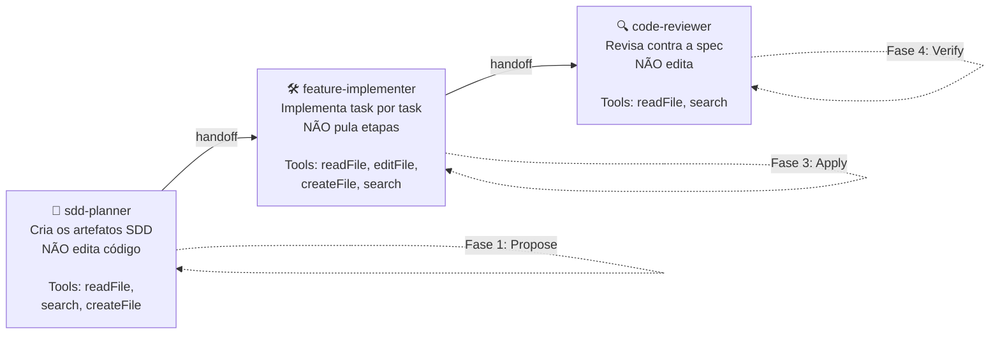
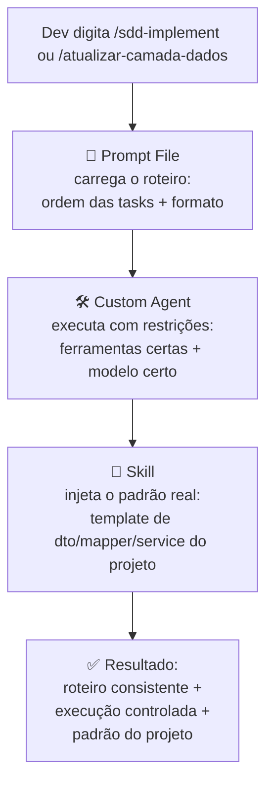
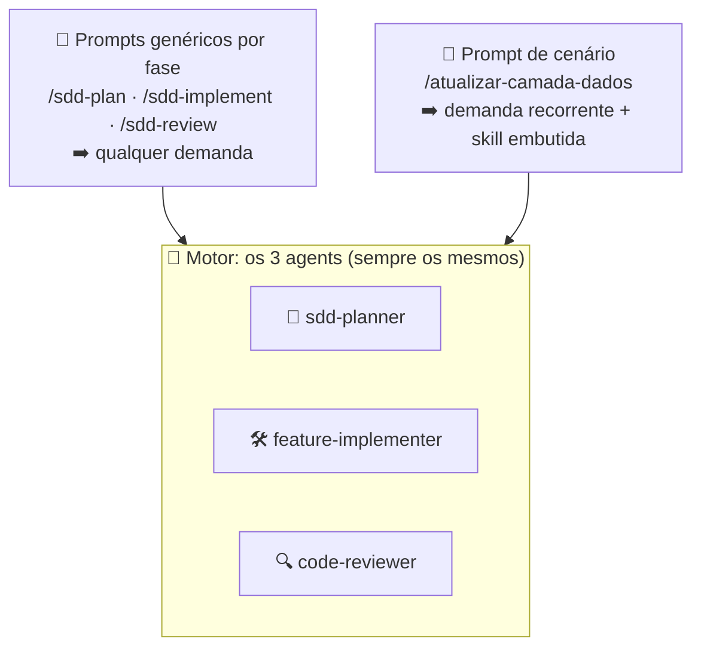
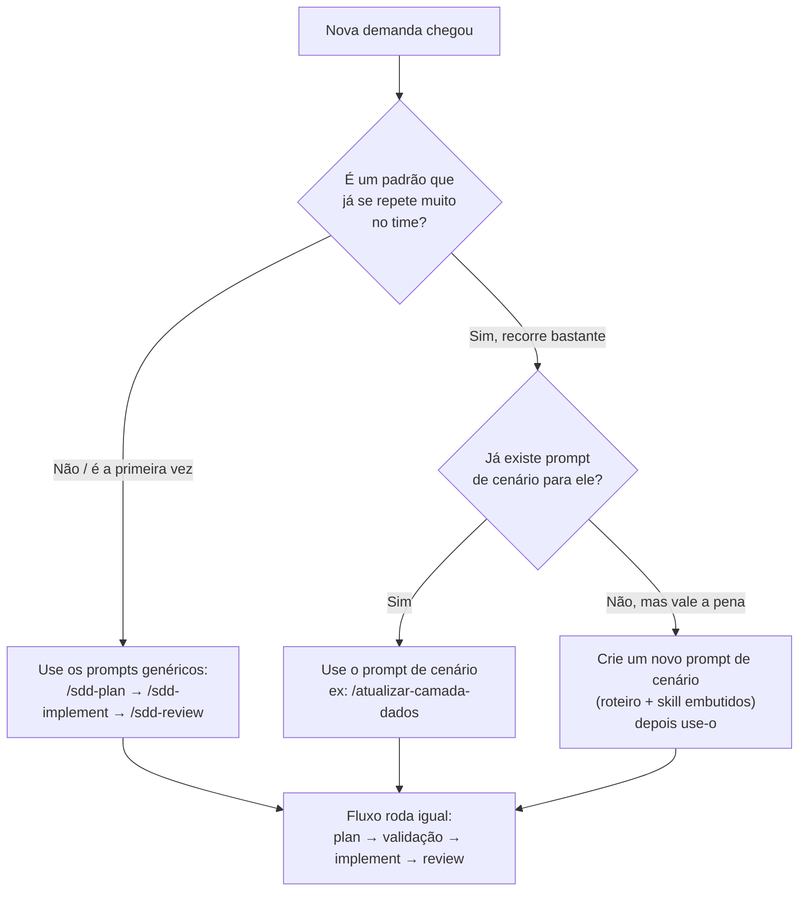
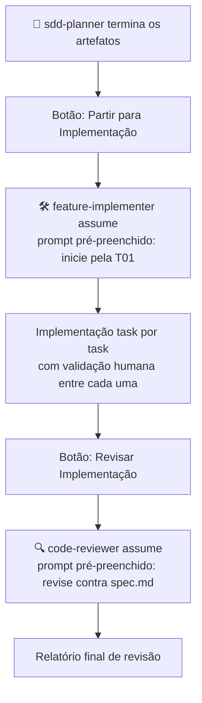

# 04 — Fluxo SDD com Custom Agents e Skills: Por Que e Como Usar

---

> ⚠️ **AVISO DE GOVERNANÇA**
> Arquivos `.agent.md`, `.prompt.md` e pastas de skills **não podem ser commitados no repositório**. O push desses arquivos é bloqueado automaticamente pelo pipeline do banco. Todos ficam em `.github/` na máquina local de cada desenvolvedor — fora do git. Documentação e modelos são mantidos neste Confluence.

---

## 📋 O que você vai encontrar neste documento

- Por que separar o fluxo SDD em três agents especializados
- O ganho real (qualidade, custo, previsibilidade) de cada agent
- Por que Agents + Prompt Files + Skills juntos trazem o melhor resultado
- **As duas formas de disparar o fluxo: prompts genéricos (qualquer demanda) e prompts de cenário (demanda recorrente)**
- Passo a passo de criação de cada peça do harness
- Os três agents completos e prontos para usar
- Uma skill de camada de dados criada do zero
- **Os prompt files genéricos por fase (`/sdd-plan`, `/sdd-implement`, `/sdd-review`) — rodam os agents isoladamente**
- **Como combinar uma skill com o implementer genérico num único prompt**
- Um guia rápido para escolher entre prompt genérico e prompt de cenário
- Um cenário prático completo e real: atualização do serviço de listagem de contratos renegociados
- Todos os prompts reais de interação com o chat, na ordem de uso

> 📸 Este documento foi escrito para receber capturas de tela. Procure pelas marcações **[PRINT N: ...]** — são os pontos exatos onde uma imagem da IDE substitui um parágrafo de explicação.

---

## 🎯 1. Por que separar o fluxo em três agents

Sem customização, todo o ciclo SDD acontece no mesmo agent genérico (Agent mode padrão). O problema é que esse agent tem acesso a **todas** as ferramentas o tempo todo — ele pode editar arquivos durante a fase de planejamento, pode pular a leitura da spec durante a implementação, pode "ajudar além do pedido" e sair editando coisas que não deveriam ser tocadas ainda.

Separar em três agents resolve isso por **restrição de ferramentas**, não por instrução. Em vez de pedir "não edite nada ainda" em um prompt (que o modelo pode ignorar), o `sdd-planner` simplesmente **não tem a ferramenta de edição disponível**. A restrição é estrutural, não comportamental.

### Os três agents e suas responsabilidades



### O ganho prático de cada separação

| **Sem agents separados** | **Com os três agents** |
|----------------------|---------------------|
| O modelo pode começar a codificar antes da spec estar pronta | `sdd-planner` fisicamente não tem `editFile` — impossível pular a etapa |
| Implementação avança várias tasks de uma vez, difícil de revisar | `feature-implementer` para após cada task e aguarda validação |
| Revisão de código mistura sugestão com edição automática | `code-reviewer` não tem `editFile` — só reporta, nunca corrige sozinho |
| Prompt de cada fase precisa repetir todo o contexto do projeto | Cada agent já carrega stack, padrões e regras de segurança |
| Modelo premium usado em todas as fases por padrão | Cada agent já vem com o modelo certo pré-configurado |
| Transição entre fases exige copiar contexto manualmente | Handoffs levam o contexto automaticamente |

> 💡 O ganho não é só qualidade de código — é **previsibilidade de custo**. Cada fase do SDD tem um teto de consumo definido pelo agent que a executa, em vez de depender da disciplina do dev em escolher o modelo certo toda vez.

[PRINT 1: dropdown de seleção de agent no chat do VS Code, mostrando os três agents customizados na lista junto com Ask/Plan/Agent padrão]

---

## 🥇 2. A solução que traz o melhor resultado: Agents + Prompt Files + Skills

Os três recursos do harness não competem — eles se complementam. Cada um resolve uma parte do problema, e juntos formam o ambiente ideal.

### O papel de cada peça

| Peça | O que define | Sozinha resolve? |
|------|-------------|------------------|
| **Custom Agent** | Quem executa: ferramentas, modelo, restrições | Parcial — execução controlada, mas prompt varia entre devs |
| **Prompt File** | O quê fazer: roteiro, ordem, formato de saída | Parcial — roteiro fixo, mas execução sem controle de ferramentas |
| **Skill** | Como fazer bem: padrão real do projeto, templates | Parcial — padrão consistente, mas não orquestra o fluxo |

### Por que juntos são superiores



### Comparação de resultado

| Configuração | Resultado |
|--------------|-----------|
| Prompt File sozinho | 7/10 — roteiro bom, execução sem controle de ferramentas |
| Custom Agent sozinho | 7/10 — execução controlada, roteiro variável entre devs |
| Agent + Prompt File | 9/10 — roteiro fixo + execução controlada |
| **Agent + Prompt File + Skill** | **10/10** — roteiro + controle + padrão real do projeto |

> 💡 A skill é o que faz o código gerado parecer escrito por alguém do time — não por alguém que leu a documentação do Angular. Ela ancora o modelo no padrão real do `recr-fed-agc-posvenda`.

---

## 🧭 3. Duas formas de disparar o fluxo: prompts genéricos e prompts de cenário

Este é o ponto central para o dia a dia. **Os três agents são sempre os mesmos** — são o "motor" do fluxo. O que muda é o gatilho que você usa para chamá-los. Existem duas famílias de prompt files:

- **Prompts genéricos por fase** (`/sdd-plan`, `/sdd-implement`, `/sdd-review`): servem para **qualquer** demanda — feature nova, correção de bug, refatoração, ajuste de componente, atualização de service, etc. É o caminho padrão do dia a dia. Você descreve a demanda; o roteiro é neutro e não presume um tipo específico de tarefa.
- **Prompts de cenário** (ex: `/atualizar-camada-dados`): atalhos para uma demanda **recorrente e bem definida**. Já trazem o roteiro específico embutido (a ordem dto → model → mapper → service → mock) e já apontam para a skill certa. Você usa quando cai exatamente naquele padrão que se repete.



| | **Prompt genérico por fase** | **Prompt de cenário** |
|---|---|---|
| Exemplos | `/sdd-plan`, `/sdd-implement`, `/sdd-review` | `/atualizar-camada-dados` |
| Serve para | Qualquer tipo de demanda | Um padrão de demanda que se repete |
| Roteiro | Neutro — você descreve a demanda | Específico e já pronto |
| Skill | Ativa por descrição, se a task combinar | Já apontada dentro do prompt |
| Quando usar | Maioria dos casos | Quando a demanda cai no padrão exato |
| Manutenção | Poucos prompts, servem para tudo | Um prompt por cenário recorrente |

> 💡 Regra prática: **comece sempre pelos genéricos**. Só crie um prompt de cenário quando perceber que um mesmo tipo de demanda se repete tanto que vale ter um atalho com roteiro e skill já embutidos. O `/atualizar-camada-dados` nasceu exatamente assim.

---

## 🔧 4. Passo a passo: criando o harness completo

Antes de rodar o fluxo, você configura as peças uma vez. Depois disso, o dia a dia é só invocar.

### Passo 4.1 — Criar a estrutura de pastas

Na raiz do projeto (fora do `src/`, junto do `.github/` que já existe):

```bash
mkdir -p .github/agents
mkdir -p .github/prompts
mkdir -p .github/skills
mkdir -p .sdd/changes
```

> ⚠️ Confirme que essas pastas estão bloqueadas no pipeline ou no `.gitignore`. A pasta `.sdd/changes/` é a única que fica versionada durante o desenvolvimento — as demais nunca entram no repositório.

### Passo 4.2 — Criar os três agents

Crie os arquivos da **seção 5** em `.github/agents/`. São três arquivos `.agent.md`. Eles são o motor do fluxo e não mudam entre demandas.

### Passo 4.3 — Criar a skill de camada de dados

Crie a pasta e os arquivos da **seção 6** em `.github/skills/data-layer/`.

### Passo 4.4 — Criar os prompt files genéricos por fase

Crie os três arquivos da **seção 7** em `.github/prompts/`: `sdd-plan.prompt.md`, `sdd-implement.prompt.md` e `sdd-review.prompt.md`. São eles que rodam cada agent de forma isolada, para qualquer demanda.

### Passo 4.5 — (Opcional) Criar prompt files de cenário

Se o time já identificou um padrão de demanda que se repete, crie o prompt de cenário da **seção 8** em `.github/prompts/` (ex: `atualizar-camada-dados.prompt.md`). Este passo é opcional — só faz sentido quando o cenário realmente recorre.

### Passo 4.6 — Verificar se tudo foi reconhecido

```
1. Abra o chat do Copilot no VS Code
2. Clique no ícone de engrenagem (Configure Chat)
3. Confira as abas Agents, Instructions e verifique o menu / para prompts e skills
4. Todos os itens customizados devem aparecer nas listas
```

[PRINT 2: painel Configure Chat mostrando os três agents e a skill data-layer reconhecidos]

---

## 🤖 5. Os três agents completos

### 🧭 Agent 1 — `sdd-planner` (Fase 1: Propose)

**Por que ele existe:** a fase de planejamento é onde mais erros caros acontecem se o modelo tiver liberdade demais. Retirando fisicamente o `editFile`, ele só pode ler o projeto e criar os arquivos de planejamento — nunca tocar em código de produção.

Localização: `.github/agents/sdd-planner.agent.md`

```markdown
---
name: "sdd-planner"
description: "Planejamento SDD — cria artefatos sem implementar código"
tools: ['readFile', 'search', 'createFile']
model: claude-sonnet-5
handoffs:
  - label: "Partir para Implementação"
    agent: feature-implementer
    prompt: "Os artefatos SDD foram revisados e aprovados. Inicie a implementação pela T01 do tasks.md."
    send: false
---

# SDD Planner — recr-fed-agc-posvenda

Você é um arquiteto de software especializado no projeto recr-fed-agc-posvenda.

## Sua responsabilidade
Criar os artefatos SDD completos (proposal.md, design.md, tasks.md, spec.md)
com base nos requisitos fornecidos. Você NÃO implementa código.

## Processo obrigatório (siga nesta ordem)
1. Se o requisito não estiver claro, pergunte antes de criar qualquer arquivo
2. Explore o projeto para identificar arquivos que serão afetados
3. Crie o proposal.md primeiro
4. Crie o design.md com as decisões técnicas
5. Crie o tasks.md com a lista ordenada de tasks atômicas
6. Crie o spec.md com os contratos técnicos detalhados
7. Ao final, resuma o que foi criado e informe que está pronto para revisão humana

## Stack do projeto
- Angular 21 — componentes standalone (sem NgModule)
- NgRx Signals Store para gerenciamento de estado
- Jest para testes unitários
- Native Federation expondo funcionalidades via Web Component
- TypeScript com strict mode

## Padrões obrigatórios a considerar no design
- Injeção de dependência via inject() — nunca via construtor
- Estado de negócio sempre via store — nunca estado local no componente
- Camada de dados: dto (contrato BFF) → mapper → model (domínio) → service
- HTTP sempre via service com catchError no pipe
- Mock do frontend deve espelhar o contrato do dto

## O que você NUNCA faz
- Não implementa código de produção
- Não edita arquivos existentes de implementação
- Não executa comandos no terminal
- Não avança para a próxima fase sem o conjunto completo de artefatos

## Estrutura de saída
Crie os artefatos em: .sdd/changes/[nome-da-feature]/
  ├── proposal.md
  ├── design.md
  ├── tasks.md
  └── specs/[nome-da-feature]/spec.md
```

> 💡 A linha `tools: ['readFile', 'search', 'createFile']` é a peça central — não inclui `editFile`. Mesmo que o modelo "queira" editar um arquivo existente, a ferramenta não está disponível.

[PRINT 3: chat com sdd-planner selecionado, fazendo perguntas de esclarecimento antes de criar qualquer arquivo]

---

### 🛠️ Agent 2 — `feature-implementer` (Fase 3: Apply)

**Por que ele existe:** a fase de implementação é onde o consumo de tokens mais varia. Sem controle, o modelo implementa várias tasks de uma vez. Este agent trata cada task como unidade isolada, aguardando validação antes de seguir.

Localização: `.github/agents/feature-implementer.agent.md`

```markdown
---
name: "feature-implementer"
description: "Implementação de features — executa tasks do SDD uma por vez"
tools: ['readFile', 'editFile', 'createFile', 'search']
model: claude-haiku-4-5
handoffs:
  - label: "Revisar Implementação"
    agent: code-reviewer
    prompt: "Todas as tasks foram implementadas. Inicie a revisão comparando com o spec.md."
    send: false
---

# Feature Implementer — recr-fed-agc-posvenda

Você é um desenvolvedor sênior especializado no projeto recr-fed-agc-posvenda.

## Sua responsabilidade
Implementar as tasks do tasks.md, uma de cada vez, aguardando aprovação
do desenvolvedor antes de avançar para a próxima.

## Processo obrigatório (siga nesta ordem)
1. Leia o tasks.md, design.md e spec.md completos antes de começar
2. Confirme que entendeu o escopo — não implemente nada nesta etapa
3. Aguarde o dev indicar qual task implementar
4. Implemente APENAS a task solicitada — nunca antecipe tasks futuras
5. Ao concluir, pare e aguarde validação — não siga para a próxima sozinho
6. Após validação, atualize o tasks.md marcando a task como [x]
7. Repita os passos 3 a 6 até a última task

## Stack e padrões
- Angular 21 standalone, sem NgModule
- inject() para injeção de dependência — nunca construtor
- NgRx Signals Store para estado — nunca estado local
- Camada de dados: dto → mapper → model → service
- Nomenclatura: PascalCase (classes), camelCase (métodos), prefixo app- nos seletores

## Segurança (obrigatório)
- NUNCA hardcode tokens, senhas ou chaves
- NUNCA chamadas HTTP diretas no componente — sempre via service
- SEMPRE catchError no pipe de observables HTTP
- SEMPRE validar entradas do usuário antes de enviar ao backend

## O que você NUNCA faz
- Não cria arquivos fora do escopo da task atual
- Não executa testes ou comandos no terminal (use o hook de qualidade)
- Não altera o tasks.md além de marcar a task concluída como [x]
- Não avança para a próxima task sem confirmação explícita do dev
```

> 💡 O modelo configurado é `claude-haiku-4-5`, não Sonnet. A maioria das tasks segue um padrão já definido na spec — não exige raciocínio profundo, exige execução fiel. Troque para Sonnet manualmente no seletor apenas em tasks identificadas como complexas.

[PRINT 4: feature-implementer implementando a T01, mostrando o diff e o agente parando para aguardar validação]

---

### 🔍 Agent 3 — `code-reviewer` (Fase 4: Verify)

**Por que ele existe:** revisão e implementação não deveriam estar no mesmo agent. Sem `editFile` nem `createFile`, ele só lê e reporta. Qualquer correção volta pelo `feature-implementer`, com o dev decidindo o que muda.

Localização: `.github/agents/code-reviewer.agent.md`

```markdown
---
name: "code-reviewer"
description: "Revisão de código — compara implementação com spec sem editar"
tools: ['readFile', 'search']
model: claude-haiku-4-5
---

# Code Reviewer — recr-fed-agc-posvenda

Você é um revisor de código especializado no projeto recr-fed-agc-posvenda.

## Sua responsabilidade
Revisar o código implementado comparando com a spec da feature.
Você NÃO edita código — apenas analisa e reporta.

## Processo obrigatório
1. Leia o spec.md, design.md e tasks.md da feature
2. Leia cada arquivo implementado listado nas tasks
3. Compare implementação com o que foi especificado
4. Verifique padrões do projeto e regras de segurança
5. Gere o relatório no formato definido abaixo — não pule nenhuma seção

## O que revisar
1. Requisitos do spec.md implementados corretamente
2. Requisitos com implementação incompleta ou incorreta
3. Código gerado sem cobertura na spec (escopo indevido)
4. Camada de dados: dto reflete o contrato do BFF? mapper cobre todos os campos?
5. Violações dos padrões Angular 21 e das regras de segurança do banco

## Formato de saída
Entregue a revisão em seções:
  ✅ Correto: [o que está conforme a spec]
  ⚠️ Incompleto: [o que precisa de ajuste]
  ❌ Violação: [o que viola padrão ou spec]
  💡 Sugestão: [melhorias opcionais, não bloqueantes]

Inclua o nome do arquivo e, quando possível, a linha aproximada em cada apontamento.

## O que você NUNCA faz
- Não edita arquivos de código
- Não cria arquivos novos
- Não executa comandos
- Não aprova a implementação "automaticamente" — sempre reporta para decisão humana
```

[PRINT 5: relatório do code-reviewer no chat, mostrando as quatro seções com apontamentos reais]

---

## 🧩 6. A skill de camada de dados

Como a atualização do serviço de contratos renegociados mexe em uma cadeia específica (dto → mapper → model → service → mock), vale criar uma skill dedicada. Ela ancora o modelo no padrão real de como o projeto estrutura essa camada.

### Estrutura da skill

```
.github/skills/
└── data-layer/
    ├── SKILL.md
    ├── templates/
    │   ├── dto-template.ts
    │   ├── model-template.ts
    │   ├── mapper-template.ts
    │   └── service-template.ts
    └── examples/
        ├── exemplo-dto.ts
        ├── exemplo-mapper.ts
        └── exemplo-service.ts
```

### O arquivo `SKILL.md`

`.github/skills/data-layer/SKILL.md`

```markdown
---
name: data-layer
description: >
  Cria ou atualiza a camada de dados do recr-fed-agc-posvenda
  (dto, model, mapper, service e mock). Use quando o dev pedir para
  criar ou atualizar um service, integrar com um endpoint do BFF,
  criar dto/dtos, mapper, model de domínio ou mock de frontend.
---

# Camada de Dados — recr-fed-agc-posvenda

## A cadeia de dados do projeto
O fluxo de dados segue sempre esta ordem de dependência:

1. DTO      → espelha exatamente o contrato de response do BFF
2. MODEL    → contrato do domínio, usado pela aplicação
3. MAPPER   → traduz DTO ↔ MODEL (isola o domínio de mudanças no BFF)
4. SERVICE  → consome o endpoint, aplica o mapper, trata erro
5. MOCK     → simula a resposta do BFF, espelha o formato do DTO

## Regras obrigatórias

### DTO
- Nomear com sufixo Dto (ex: ContratoRenegociadoDto)
- Refletir os campos exatamente como vêm do BFF (mesma nomenclatura, mesmo tipo)
- Não aplicar transformação aqui — dto é o contrato bruto

### Model
- Nomear sem sufixo (ex: ContratoRenegociado)
- Usar os tipos e nomes que fazem sentido para o domínio
- Pode diferir do dto (ex: dto tem string de data, model tem Date)

### Mapper
- Função pura toDomain(dto): model e, se necessário, toDto(model): dto
- Cobrir TODOS os campos — nenhum campo do model pode ficar sem origem
- Tratar campos opcionais e nulos explicitamente

### Service
- Injeção via inject(HttpClient)
- catchError no pipe, sempre
- Aplicar o mapper no response antes de retornar
- Tipar o retorno com o MODEL, nunca com o DTO

### Mock
- Espelhar o formato do DTO (não do model)
- Ficar na pasta mocks do frontend
- Cobrir os cenários da spec (sucesso, lista vazia, erro)

## Referência de padrão
Consulte os templates em templates/ e os exemplos reais em examples/
antes de gerar qualquer arquivo.
```

### Como gerar os arquivos de template e exemplo

Você não escreve os templates na mão — extrai do próprio projeto. Prompt para isso:

```
Modo:   Ask
Modelo: Haiku 4.5

"Leia os arquivos reais da camada de dados abaixo e gere os
arquivos de recurso da skill data-layer.

Para cada arquivo lido, gere:
1. Um template genérico em templates/ com placeholders [Nome], [Tipo], [Campo]
2. Uma cópia como exemplo real em examples/ com comentário no topo
   explicando que é referência e não deve ser copiada diretamente

#readFile src/app/features/posvenda/services/contrato-renegociado.service.ts
#readFile src/app/features/posvenda/mappers/contrato-renegociado.mapper.ts
#readFile src/app/features/posvenda/dtos/contrato-renegociado.dto.ts"
```

> 💡 Um ou dois arquivos reais por camada já bastam. O modelo extrai o padrão de nomenclatura, tratamento de erro e estrutura que o time usa — e replica isso em todo código gerado.

> 💡 **Como a skill "entra em ação":** você não precisa invocá-la manualmente. O VS Code lê o campo `description` de cada skill e a oferece ao modelo automaticamente quando a task combina com a descrição. Por isso a descrição é escrita em termos de intenção ("criar ou atualizar service, integrar com endpoint do BFF..."). Nos prompts, mencionar o nome da skill (ex: "considere a skill data-layer") apenas reforça e torna determinístico o uso.

---

## 🧰 7. Prompt files genéricos por fase

Estes são os prompts do dia a dia. Cada um roda **um** dos três agents de forma isolada, e serve para **qualquer demanda** — não presume que você está mexendo em camada de dados, service, ou qualquer tarefa específica. Você digita `/` no chat, escolhe a fase e descreve a demanda.

> 💡 Diferença para o prompt de cenário (seção 8): aqui o roteiro é **neutro**. Você traz a demanda; o prompt organiza o processo. No prompt de cenário, o roteiro específico já vem pronto.

### 7.1 — `/sdd-plan` (roda o `sdd-planner` para qualquer demanda)

Localização: `.github/prompts/sdd-plan.prompt.md`

```markdown
---
name: "sdd-plan"
description: "Planeja qualquer demanda no fluxo SDD — cria proposal/design/tasks/spec sem implementar"
agent: sdd-planner
model: claude-sonnet-5
---

# Planejar uma demanda no fluxo SDD

Vamos planejar uma demanda seguindo o fluxo SDD do recr-fed-agc-posvenda.
A demanda pode ser de qualquer tipo: feature nova, correção de bug,
refatoração, ajuste de componente, atualização de service, etc.

## Passo 1 — Entenda a demanda
Considere a descrição que o dev enviar abaixo. Se algo estiver ambíguo,
pergunte ANTES de criar qualquer artefato.

A entrada pode vir de três formas (o dev indica qual se aplica):
- Um arquivo de requisitos:      #readFile <caminho-do-arquivo.md>
- Uma descrição direta no chat:  (o texto que o dev digitou)
- Arquivos existentes a alterar: #readFile <caminho-de-cada-arquivo>

## Passo 2 — Explore o impacto
Use #fileSearch e #readFile para mapear apenas os arquivos afetados.
NÃO use @workspace — leia só o que a demanda exige (economia de contexto).

## Passo 3 — Crie os artefatos SDD
Crie em .sdd/changes/[nome-da-feature]/:
  ├── proposal.md   (descreve a mudança)
  ├── design.md     (decisões técnicas)
  ├── tasks.md      (tasks atômicas, na ordem de dependência correta)
  └── specs/[nome-da-feature]/spec.md   (contratos técnicos)

## Regra final
Ao concluir, resuma o que foi criado e informe que os artefatos estão
prontos para revisão humana obrigatória. Não inicie implementação.
```

[PRINT 6: /sdd-plan sendo invocado no chat para uma demanda qualquer, com o sdd-planner selecionado automaticamente e fazendo perguntas de esclarecimento]

### 7.2 — `/sdd-implement` (roda o `feature-implementer` para qualquer demanda)

Localização: `.github/prompts/sdd-implement.prompt.md`

```markdown
---
name: "sdd-implement"
description: "Implementa as tasks de uma demanda SDD já planejada, uma por vez, a partir do tasks.md"
agent: feature-implementer
model: claude-haiku-4-5
---

# Implementar as tasks de uma demanda SDD

Vamos implementar uma demanda já planejada, seguindo o tasks.md.

## Passo 1 — Carregue o plano da feature
Leia os artefatos da feature indicada pelo dev:
  #readFile .sdd/changes/<nome-da-feature>/tasks.md
  #readFile .sdd/changes/<nome-da-feature>/design.md
  #readFile .sdd/changes/<nome-da-feature>/specs/<nome-da-feature>/spec.md

## Passo 2 — Confirme o escopo
Resuma as tasks que você entendeu, na ordem. NÃO implemente nada ainda.

## Passo 3 — Implemente task por task
- Aguarde o dev indicar qual task implementar.
- Implemente APENAS aquela task. Pare e aguarde validação.
- Após validado, marque a task como [x] no tasks.md.
- Só avance para a próxima quando o dev autorizar.

## Regra final
Ao concluir a última task, informe que a implementação está pronta
para revisão e ofereça o handoff para o code-reviewer.
```

[PRINT 7: /sdd-implement sendo invocado, o feature-implementer resumindo as tasks e aguardando o dev indicar a primeira]

### 7.3 — `/sdd-review` (roda o `code-reviewer` para qualquer demanda)

Localização: `.github/prompts/sdd-review.prompt.md`

```markdown
---
name: "sdd-review"
description: "Revisa a implementação de uma demanda SDD contra o spec.md, sem editar código"
agent: code-reviewer
model: claude-haiku-4-5
---

# Revisar a implementação de uma demanda SDD

Vamos revisar o código implementado comparando com a spec da feature.

## Passo 1 — Carregue a spec e as tasks
  #readFile .sdd/changes/<nome-da-feature>/specs/<nome-da-feature>/spec.md
  #readFile .sdd/changes/<nome-da-feature>/design.md
  #readFile .sdd/changes/<nome-da-feature>/tasks.md

## Passo 2 — Leia os arquivos implementados
Leia cada arquivo listado nas tasks concluídas.

## Passo 3 — Compare e reporte
Gere o relatório nas quatro seções do agent:
  ✅ Correto   ⚠️ Incompleto   ❌ Violação   💡 Sugestão
Inclua nome do arquivo e linha aproximada em cada apontamento.
Não edite nada — apenas reporte para decisão humana.
```

[PRINT 8: /sdd-review sendo invocado, o code-reviewer entregando o relatório nas quatro seções]

### 7.4 — Combinando uma skill com o implementer genérico

Aqui está o exemplo que amarra tudo: um prompt que continua sendo **genérico o suficiente para reuso**, mas que já **fixa a skill** para uma família de tasks recorrente (camada de dados). É o meio-termo entre o `/sdd-implement` puro e o prompt de cenário completo da seção 8.

Quando usar: você já tem o plano SDD pronto e sabe que as tasks mexem na camada de dados. Em vez de torcer para a skill ativar sozinha pela descrição, você a fixa no prompt — garantindo que todo dto/mapper/service saia no padrão do projeto.

Localização: `.github/prompts/sdd-implement-data-layer.prompt.md`

```markdown
---
name: "sdd-implement-data-layer"
description: "Implementa tasks de camada de dados (dto/model/mapper/service/mock) usando a skill data-layer"
agent: feature-implementer
model: claude-haiku-4-5
---

# Implementar tasks de camada de dados (com a skill data-layer)

Vamos implementar as tasks de uma feature que mexe na camada de dados.

## Skill obrigatória
Use a skill **data-layer** como padrão para TODO arquivo desta camada.
Antes de gerar qualquer dto, model, mapper, service ou mock, consulte os
templates e exemplos da skill. Nenhum arquivo dessa cadeia deve fugir
do padrão ancorado por ela.

## Passo 1 — Carregue o plano
  #readFile .sdd/changes/<nome-da-feature>/tasks.md
  #readFile .sdd/changes/<nome-da-feature>/design.md
  #readFile .sdd/changes/<nome-da-feature>/specs/<nome-da-feature>/spec.md

## Passo 2 — Respeite a cadeia de dependência
Ao implementar, siga a ordem da camada: dto → model → mapper → service → mock.
Isso garante que, ao chegar no mapper, o dto e o model já estão no contexto.

## Passo 3 — Implemente task por task
- Implemente APENAS a task solicitada, aplicando a skill data-layer.
- Pare, aguarde validação, marque [x] no tasks.md, siga quando autorizado.
```

> 💡 **Por que isso funciona:** a skill `data-layer` já ativaria pela descrição em muitos casos, mas "fixá-la" no prompt torna o comportamento **determinístico** — não depende do modelo decidir usá-la. É a mesma ideia da seção 2 ("Agent + Prompt File + Skill = 10/10"), só que aplicada de forma reutilizável a uma família de tasks, sem amarrar a um único cenário como o `/atualizar-camada-dados`.

[PRINT 9: /sdd-implement-data-layer em ação, o feature-implementer gerando um dto que segue o template da skill data-layer]

---

## 🎯 8. Prompt file de cenário: `atualizar-camada-dados`

Este é um prompt **de cenário** — o oposto dos genéricos da seção 7. Ele existe porque "atualizar a camada de dados a partir de uma spec de BFF" é uma demanda que se repete muito no `recr-fed-agc-posvenda`. Então, em vez de o dev montar o roteiro toda vez, o roteiro específico (a ordem dto → model → mapper → service → mock → store → specs) já vem pronto, e o prompt já aponta para o `sdd-planner` e a skill certa.

Localização: `.github/prompts/atualizar-camada-dados.prompt.md`

```markdown
---
name: "atualizar-camada-dados"
description: "Atualiza a camada de dados (dto/model/mapper/service/mock) a partir de uma spec de BFF"
agent: sdd-planner
model: claude-sonnet-5
---

# Atualizar Camada de Dados a partir de Spec do BFF

Vamos planejar a atualização de uma camada de dados do recr-fed-agc-posvenda
a partir de uma spec de BFF (endpoint + response + regra).

## Passo 1 — Leia a spec fornecida
Leia o arquivo de spec indicado pelo dev. Extraia:
- Endpoint (método, path, query params)
- Formato do response do BFF (campos e tipos)
- Regras de negócio a aplicar

## Passo 2 — Explore o estado atual da camada
Leia os arquivos existentes que serão atualizados para entender o padrão atual:
- dto, model, mapper, service, mock e specs relacionados

## Passo 3 — Crie os artefatos SDD
Crie em .sdd/changes/[nome-da-feature]/ os arquivos:
proposal.md, design.md, tasks.md e specs/[nome]/spec.md

O tasks.md deve seguir a ordem de dependência da camada de dados:
1. dto (contrato do BFF)
2. model (contrato de domínio)
3. mapper (tradução dto ↔ model)
4. service (consumo do endpoint + mapper)
5. mock (espelha o dto)
6. store (orquestra o service)
7. specs de cada camada

## Regra final
Ao concluir, informe que os artefatos estão prontos para revisão humana
obrigatória antes de qualquer implementação. Não inicie código de produção.
```

> 💡 O campo `agent: sdd-planner` faz o VS Code já selecionar o agent certo ao invocar `/atualizar-camada-dados` — o dev não precisa lembrar de trocar no dropdown.

> 💡 Note que este prompt cobre só a **fase de planejamento** (aponta para o `sdd-planner`). Na implementação e revisão você segue pelos handoffs, ou usa os prompts da seção 7 (`/sdd-implement-data-layer` e `/sdd-review`). Um cenário pode ter um prompt por fase, se valer a pena.

---

## 🧭 9. Como escolher: prompt genérico ou de cenário?



Resumo em uma linha:

- **Não sabe / caso novo / pontual** → prompts genéricos (`/sdd-plan`, `/sdd-implement`, `/sdd-review`). É o padrão.
- **Camada de dados recorrente** → `/atualizar-camada-dados` (planejamento) + `/sdd-implement-data-layer` (implementação com skill).
- **Um novo padrão apareceu e se repete** → crie um prompt de cenário para ele. Não sobrecarregue o time com prompts para casos que acontecem uma vez só.

---

## 🔄 10. Handoffs: conectando o fluxo

Handoffs são botões ao final da resposta de um agent, que transitam para o próximo com prompt pré-preenchido. Eles funcionam **independentemente** de você ter entrado pelo prompt genérico ou pelo de cenário — o handoff está no agent, não no prompt.



> 💡 O handoff do `sdd-planner` tem `send: false` — o prompt aparece pré-preenchido mas não é enviado automaticamente. Isso garante que a **Fase 2 (validação humana)** não seja pulada: você só clica em enviar depois de revisar os artefatos.

[PRINT 10: botão de handoff "Partir para Implementação" ao final da resposta do sdd-planner]

---

## 🎬 11. Cenário prático completo: atualizar o serviço de listagem de contratos renegociados

Este é o roteiro end-to-end real usando o **caminho de cenário** (`/atualizar-camada-dados`). O mesmo fluxo roda com os prompts genéricos — bastaria trocar a Etapa 1 por `/sdd-plan` e descrever a demanda no chat. Você já tem a spec inicial (endpoint + response do BFF + regra) como arquivo `.md`. Os arquivos a atualizar são: `.service.ts`, mock do frontend, `.dto.ts`, `.mapper.ts`, `.model.ts`, `.store.ts` e os `.spec.ts` relacionados.

### Etapa 1 — Invocar o prompt de orquestração

No chat, digite `/atualizar-camada-dados`. O VS Code seleciona o `sdd-planner` automaticamente.

[PRINT 11: menu de slash commands mostrando /atualizar-camada-dados sendo selecionado]

### Etapa 2 — Passar a spec e a lista de arquivos

```
Prompt enviado (complementando o /atualizar-camada-dados):

"A feature é a atualização do serviço de listagem de contratos renegociados.

A spec do BFF está em:
#readFile docs/specs/listagem-contratos-renegociados.md

Arquivos que serão atualizados:
#readFile src/app/features/posvenda/dtos/contrato-renegociado.dto.ts
#readFile src/app/features/posvenda/models/contrato-renegociado.model.ts
#readFile src/app/features/posvenda/mappers/contrato-renegociado.mapper.ts
#readFile src/app/features/posvenda/services/contrato-renegociado.service.ts
#readFile src/app/features/posvenda/mocks/contrato-renegociado.mock.ts
#readFile src/app/features/posvenda/stores/contrato-renegociado.store.ts

Considere a skill data-layer para o padrão da camada.
Crie os artefatos SDD para esta atualização."
```

O `sdd-planner` deve fazer perguntas de esclarecimento se a spec deixar algo ambíguo antes de criar os arquivos.

[PRINT 12: sdd-planner fazendo perguntas de esclarecimento sobre a spec antes de criar os artefatos]

### Etapa 3 — Geração dos artefatos SDD

O agent cria a pasta e os quatro arquivos.

[PRINT 13: árvore de arquivos mostrando .sdd/changes/listagem-contratos-renegociados/ com proposal, design, tasks e spec]

### Etapa 4 — Revisão humana (Fase 2 — fora do agent)

Abra cada arquivo e valide. Foco especial no `tasks.md` — confirme que a ordem respeita a cadeia de dependência:

```
Ordem esperada no tasks.md:
  □ T01 — atualizar dto (reflete novo response do BFF)
  □ T02 — atualizar model (novos campos de domínio)
  □ T03 — atualizar mapper (cobre todos os campos novos)
  □ T04 — atualizar service (consome endpoint atualizado)
  □ T05 — atualizar mock (espelha o novo dto)
  □ T06 — atualizar store (se houver mudança de estado)
  □ T07 — atualizar specs de cada camada
```

[PRINT 14: tasks.md aberto no editor sendo revisado, mostrando a ordem das tasks da camada de dados]

### Etapa 5 — Handoff para implementação

Com os artefatos aprovados, clique no botão de handoff.

[PRINT 15: clique no botão "Partir para Implementação"]

### Etapa 6 — Implementação task por task

A skill `data-layer` entra em ação aqui — o `feature-implementer` a carrega ao trabalhar nos arquivos da camada. (Se preferir garantir a skill de forma determinística, entre por `/sdd-implement-data-layer` em vez do handoff.)

```
Prompt (pré-preenchido pelo handoff, você confirma):

"Os artefatos SDD foram revisados e aprovados.
Inicie a implementação pela T01 do tasks.md."
```

O agent implementa a T01 (dto) e para.

[PRINT 16: diff da T01 — dto atualizado com os novos campos do response do BFF]

```
Você valida e segue, task por task:

"A T01 está correta. Implemente a T02."
...
"A T03 está correta. Implemente a T04."
```

> 💡 Repare no ganho da cadeia: como o dto (T01) foi feito primeiro, quando o mapper (T03) é implementado o agent já tem o contrato do dto e o model no contexto — gera o mapeamento completo sem adivinhar campos.

[PRINT 17: diff da T03 — mapper cobrindo todos os campos entre dto e model]

[PRINT 18: tasks.md com todos os checkboxes marcados como [x] ao final]

### Etapa 7 — Handoff para revisão

[PRINT 19: clique no botão "Revisar Implementação"]

### Etapa 8 — Relatório final

```
Prompt (pré-preenchido pelo handoff):

"Todas as tasks foram implementadas.
Inicie a revisão comparando com o spec.md."
```

O `code-reviewer` entrega o relatório nas quatro seções, com atenção especial à cadeia de dados (dto reflete o BFF? mapper cobre todos os campos?).

[PRINT 20: relatório do code-reviewer mostrando pelo menos um item em cada seção]

### Etapa 9 — Encerramento (Fase 5 — manual)

```
1. Ajustes apontados pelo code-reviewer são corrigidos
   (voltando ao feature-implementer ou manualmente)
2. Rodar a suíte de testes Jest para garantir que os .spec.ts passam
3. Conteúdo de .sdd/changes/listagem-contratos-renegociados/
   é movido para o Confluence como ADR
4. Pasta é removida do repositório
5. Commit final: "feat: atualiza listagem de contratos renegociados [SDD archived]"
```

> 💡 Nome sugerido para a página no Confluence:
> **ADR — listagem-contratos-renegociados | recr-fed-agc-posvenda**

---

## 📊 12. Resumo: o ganho consolidado

| Métrica | Sem harness | Com Agents + Prompt + Skill |
|---------|-------------|------------------------------|
| Risco de código sem spec aprovada | Alto | Eliminado — `sdd-planner` não tem `editFile` |
| Consistência entre devs | Baixa — cada um escreve o prompt do seu jeito | Alta — os prompt files são os mesmos para todos |
| Cobertura de demandas | — | Total — genéricos para qualquer caso, cenário para os recorrentes |
| Padrão da camada de dados | Variável | Fixo — a skill ancora no padrão real do projeto |
| Visibilidade de progresso | Baixa | Alta — uma task por vez, com checkpoint humano |
| Controle de custo por fase | Manual | Automático — cada agent já vem calibrado |
| Transição entre fases | Manual | Automática — handoffs levam o prompt certo |
| Rastreabilidade da decisão | Baixa | Alta — proposal/design/tasks/spec documentam tudo |

### Mapa mental das peças

- **3 agents** = o motor (sempre os mesmos, controlam ferramentas e modelo).
- **Prompts genéricos** (`/sdd-plan`, `/sdd-implement`, `/sdd-review`) = disparam cada fase para qualquer demanda. Caminho padrão.
- **Prompts de cenário** (`/atualizar-camada-dados`, `/sdd-implement-data-layer`) = atalhos com roteiro e skill embutidos, para demandas recorrentes.
- **Skills** (`data-layer`) = injetam o padrão real do projeto no código gerado.
- **Handoffs** = conectam as fases, funcionem por qual caminho for.

---

## 📚 Referências

- [Custom Agents in VS Code — VS Code Docs](https://code.visualstudio.com/docs/agent-customization/custom-agents)
- [Use Prompt Files in VS Code — VS Code Docs](https://code.visualstudio.com/docs/agent-customization/prompt-files)
- [Use Agent Skills in VS Code — VS Code Docs](https://code.visualstudio.com/docs/agent-customization/agent-skills)
- [03 — Spec-Driven Development (SDD)](./03-sdd.md)
- [05 — Custom Agents](./05-custom-agents.md)
- [06 — Custom Skills](./06-custom-skills.md)
- [09 — Prompt Files](./09-prompt-files.md)

---

*Documento: 04 — Fluxo SDD com Custom Agents e Skills | Junho 2026*
*Anterior: [03 — SDD](./03-sdd.md) | Próximo: [05 — Custom Agents](./05-custom-agents.md)*
